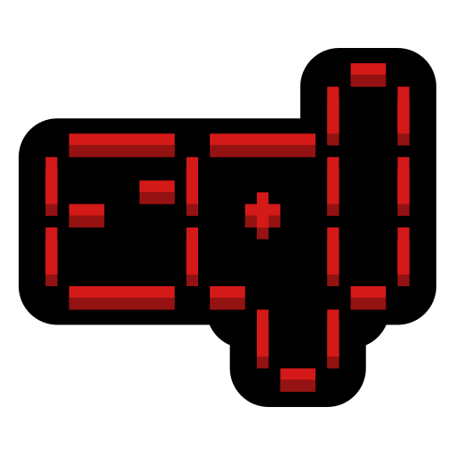

<!-- Texto animado estilo hacker -->

  

<!-- GIF animado de intro -->

  

<h1>About me</h1>

<table>
<tr>
<td width="60%" align="left" valign="middle">
  
- I'm passionate about ethical hacking and everything related to penetration testing.
- I'm self-taught; I like to learn by breaking things down and understanding how they work.
- I spend hours in labs, CTFs, and on vulnerable machines.
- I primarily work in Linux environments.
- I'm always looking to improve my techniques and learn something new every day.
  
</td>
<td width="40%" align="center" valign="middle">

</td>
</tr>
</table>

<h1>Skills</h1>

| Tools | Scripting |
| ------------- | ------------- |
|                |  |

 

<h1>Operating Systems</h1>

  

---

| Snake Eating Contributions in the last year |
| ------------------------------------------|
|  |

---

<!-- Cuadros centrados y ordenados -->

| Most Used Languages |  Streak |
|----------------------|----------------|
|  |  |

